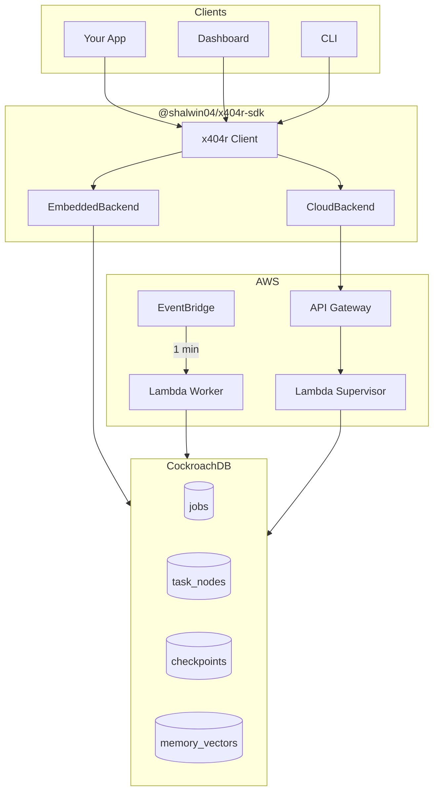

# x404-r Architecture Diagram Specifications

Use these specifications to create a visual diagram in Figma, draw.io, or similar tools.

---

## Main Architecture Diagram

### Layout: Top-to-Bottom Flow

```
┌─────────────────────────────────────────────────────────────────┐
│                         CLIENT LAYER                             │
│  ┌───────────┐   ┌───────────┐   ┌───────────┐   ┌───────────┐ │
│  │ Your App  │   │ Dashboard │   │    SDK    │   │    CLI    │ │
│  │ (Node.js) │   │ (Next.js) │   │  (Cloud)  │   │           │ │
│  └─────┬─────┘   └─────┬─────┘   └─────┬─────┘   └─────┬─────┘ │
└────────┼───────────────┼───────────────┼───────────────┼────────┘
         │               │               │               │
         └───────────────┴───────┬───────┴───────────────┘
                                 │
                                 ▼
┌─────────────────────────────────────────────────────────────────┐
│                    @shalwin04/x404r-sdk                          │
│  ┌─────────────────────────────────────────────────────────────┐│
│  │  x404r Client                                                ││
│  │  • workflow()  • worker()  • submit()  • checkpoint()        ││
│  ├─────────────────────────────────────────────────────────────┤│
│  │  Backend Abstraction                                         ││
│  │  ┌──────────────────┐      ┌──────────────────┐             ││
│  │  │ EmbeddedBackend  │      │  CloudBackend    │             ││
│  │  │ (Direct DB)      │      │  (HTTP API)      │             ││
│  │  └────────┬─────────┘      └────────┬─────────┘             ││
│  └───────────┼─────────────────────────┼───────────────────────┘│
└──────────────┼─────────────────────────┼────────────────────────┘
               │                         │
               │    ┌────────────────────┘
               │    │
               ▼    ▼
┌─────────────────────────────────────────────────────────────────┐
│                         AWS LAYER                                │
│                                                                  │
│  ┌─────────────┐    ┌─────────────┐    ┌─────────────┐         │
│  │   Lambda    │    │   Lambda    │    │    API      │         │
│  │   Worker    │◄───│ EventBridge │    │   Gateway   │         │
│  │             │    │  (1 min)    │    │             │         │
│  │ • Claim     │    └─────────────┘    │ • /jobs     │         │
│  │ • Execute   │                       │ • /ready    │         │
│  │ • Checkpoint│    ┌─────────────┐    │ • /chaos    │         │
│  │ • Heartbeat │    │   Lambda    │◄───┤             │         │
│  └──────┬──────┘    │ Supervisor  │    └─────────────┘         │
│         │           │             │                             │
│         │           │ • Create job│    ┌─────────────┐         │
│         │           │ • Decompose │    │  Secrets    │         │
│         │           │ • Auth      │    │  Manager    │         │
│         │           └──────┬──────┘    │ • DB_URL    │         │
│         │                  │           │ • API_KEY   │         │
│         └────────┬─────────┘           └─────────────┘         │
│                  │                                              │
└──────────────────┼──────────────────────────────────────────────┘
                   │
                   ▼
┌─────────────────────────────────────────────────────────────────┐
│                     COCKROACHDB SERVERLESS                       │
│                                                                  │
│  ┌───────────┐ ┌───────────┐ ┌───────────┐ ┌───────────┐       │
│  │  tenants  │ │   jobs    │ │task_nodes │ │checkpoints│       │
│  │           │ │           │ │           │ │           │       │
│  │ • id      │ │ • id      │ │ • id      │ │ • id      │       │
│  │ • plan    │ │ • status  │ │ • status  │ │ • state   │       │
│  │ • limits  │ │ • input   │ │ • worker  │ │ • step    │       │
│  └───────────┘ └───────────┘ └───────────┘ └───────────┘       │
│                                                                  │
│  ┌───────────┐ ┌───────────┐                                    │
│  │  memory   │ │  usage    │   KEY FEATURES:                    │
│  │ _vectors  │ │ _events   │   • FOR UPDATE SKIP LOCKED         │
│  │           │ │           │   • Distributed Transactions       │
│  │ • embed   │ │ • tenant  │   • JSON Columns                   │
│  │ • context │ │ • count   │   • Vector Storage                 │
│  └───────────┘ └───────────┘                                    │
│                                                                  │
└─────────────────────────────────────────────────────────────────┘
```

---

## Color Scheme

| Component | Color | Hex |
|-----------|-------|-----|
| Client Layer | Light Blue | #E3F2FD |
| SDK | Blue | #2196F3 |
| AWS Services | Orange | #FF9800 |
| Lambda | Orange Darker | #F57C00 |
| API Gateway | Purple | #9C27B0 |
| EventBridge | Yellow | #FFC107 |
| CockroachDB | Green | #4CAF50 |
| Arrows | Gray | #757575 |

---

## Crash Recovery Flow Diagram

### Visual Sequence (Left to Right)

```
┌─────────────────────────────────────────────────────────────────────────────┐
│                         CRASH RECOVERY SEQUENCE                              │
├─────────────────────────────────────────────────────────────────────────────┤
│                                                                              │
│   STEP 1: Normal Execution                                                   │
│   ┌──────────┐                      ┌──────────────┐                        │
│   │ Worker A │ ─── checkpoint ────▶ │ CockroachDB  │                        │
│   │    🔄    │      {p: 3}          │   state: 3   │                        │
│   └──────────┘                      └──────────────┘                        │
│                                                                              │
│   STEP 2: Crash Happens                                                      │
│   ┌──────────┐                      ┌──────────────┐                        │
│   │ Worker A │                      │ CockroachDB  │                        │
│   │    💥    │ ◄── CRASH            │   state: 3   │ ← Preserved!           │
│   └──────────┘                      └──────────────┘                        │
│                                                                              │
│   STEP 3: Recovery                                                           │
│   ┌──────────┐                      ┌──────────────┐                        │
│   │ Worker B │ ◄── claim + load ─── │ CockroachDB  │                        │
│   │    🔄    │      state: 3        │   state: 3   │                        │
│   │          │                      │              │                        │
│   │ Resume   │ ─── checkpoint ────▶ │   state: 4   │                        │
│   │ from 3!  │      {p: 4}          │              │                        │
│   │    ✅    │                      │   DONE! ✅   │                        │
│   └──────────┘                      └──────────────┘                        │
│                                                                              │
│   RESULT: Zero progress lost. Task continued from step 3.                    │
│                                                                              │
└─────────────────────────────────────────────────────────────────────────────┘
```

---

## DAG Workflow Diagram

### Show parallel execution + dependencies

```
┌─────────────────────────────────────────────────────────────────┐
│                    DAG WORKFLOW EXECUTION                        │
├─────────────────────────────────────────────────────────────────┤
│                                                                  │
│     ┌─────────┐                                                 │
│     │  START  │                                                 │
│     └────┬────┘                                                 │
│          │                                                      │
│          ▼                                                      │
│     ┌─────────┐                                                 │
│     │ Task A  │ ─────────────┐                                  │
│     │  Parse  │              │                                  │
│     │   ✅    │              │                                  │
│     └────┬────┘              │                                  │
│          │                   │                                  │
│     ┌────┴────┐         ┌────┴────┐                            │
│     ▼         ▼         ▼         │                            │
│ ┌─────────┐ ┌─────────┐ ┌─────────┐                            │
│ │ Task B  │ │ Task C  │ │ Task D  │   ← Parallel Execution     │
│ │  Lint   │ │ Analyze │ │  Test   │                            │
│ │   ✅    │ │   🔄    │ │   ⏳    │                            │
│ └────┬────┘ └────┬────┘ └────┬────┘                            │
│      │           │           │                                  │
│      └───────────┼───────────┘                                  │
│                  │                                              │
│                  ▼                                              │
│             ┌─────────┐                                         │
│             │ Task E  │ ← Waits for B, C, D                     │
│             │ Report  │                                         │
│             │   ⏳    │                                         │
│             └────┬────┘                                         │
│                  │                                              │
│                  ▼                                              │
│             ┌─────────┐                                         │
│             │   END   │                                         │
│             └─────────┘                                         │
│                                                                  │
│  Legend: ✅ Complete  🔄 Running  ⏳ Pending  💥 Failed         │
│                                                                  │
└─────────────────────────────────────────────────────────────────┘
```

---

## Component Icons

Use these icons in your diagram:

| Component | Icon Suggestion |
|-----------|-----------------|
| Lambda | AWS Lambda icon (orange function) |
| API Gateway | AWS API Gateway icon |
| EventBridge | AWS EventBridge icon (clock/schedule) |
| Secrets Manager | Key/lock icon |
| CockroachDB | CockroachDB logo (green roach) |
| Next.js | Next.js logo or React icon |
| Worker | Gear/cog icon |
| Checkpoint | Save/disk icon |
| Crash | Lightning bolt or explosion |
| Recovery | Green checkmark or refresh arrow |

---

## Simple One-Slide Version

For presentations or thumbnails:

```
┌─────────────────────────────────────────────────────────────────┐
│                         x404-r                                   │
│           "The runtime where context is never lost"             │
├─────────────────────────────────────────────────────────────────┤
│                                                                  │
│         ┌───────────┐         ┌───────────┐                     │
│         │   SDK     │         │ Dashboard │                     │
│         │  (npm)    │         │ (Vercel)  │                     │
│         └─────┬─────┘         └─────┬─────┘                     │
│               │                     │                            │
│               └──────────┬──────────┘                            │
│                          │                                       │
│                          ▼                                       │
│    ┌─────────────────────────────────────────────────┐          │
│    │              AWS Lambda Workers                  │          │
│    │     ┌───────┐  ┌───────┐  ┌───────┐            │          │
│    │     │   W1  │  │   W2  │  │   W3  │            │          │
│    │     └───┬───┘  └───┬───┘  └───┬───┘            │          │
│    └─────────┼──────────┼──────────┼────────────────┘          │
│              │          │          │                             │
│              └──────────┼──────────┘                             │
│                         │                                        │
│                         ▼                                        │
│              ┌─────────────────────┐                            │
│              │    CockroachDB      │                            │
│              │  ┌───────────────┐  │                            │
│              │  │ Checkpoints   │  │  ← State lives here!       │
│              │  │ Task State    │  │                            │
│              │  │ Memory        │  │                            │
│              │  └───────────────┘  │                            │
│              └─────────────────────┘                            │
│                                                                  │
│     Worker crashes? Another picks up from last checkpoint.      │
│                    Zero progress lost.                           │
│                                                                  │
└─────────────────────────────────────────────────────────────────┘
```

---

## Tools to Create Diagrams

1. **Excalidraw** (excalidraw.com) - Hand-drawn style, good for presentations
2. **draw.io** (diagrams.net) - Professional diagrams, free
3. **Figma** - Design tool, good for polished graphics
4. **Mermaid** - Code-based diagrams (GitHub supports)
5. **Lucidchart** - Professional, cloud-based

## Export Formats

- **PNG** - For DevPost, README
- **SVG** - For scalable graphics
- **PDF** - For documentation

---

## Mermaid Diagram (GitHub Compatible)


